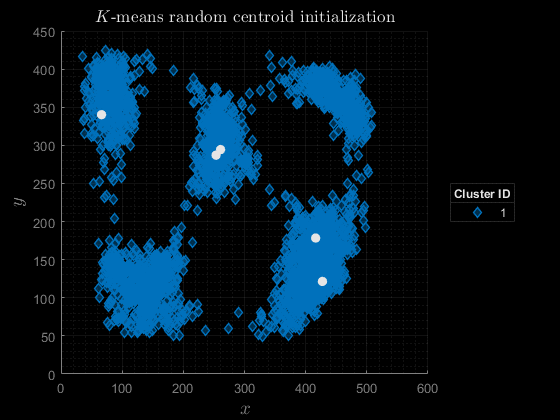

# Scalable Probabilistic Approximation Method in Applications

This repository contains a MATLAB implementation that was developed as a part of my bachelor thesis at VSB – Technical University of Ostrava. The content is now freely accessible on the [Digital repository VSB-TUO](https://dspace.vsb.cz/handle/10084/150159).

## Abstract

This thesis aims to extend the research on the newly developed Scalable Probabilistic Approximation (SPA) method, with emphasis predominantly on classification problems. The SPA method is utilized to discretize continuous stochastic processes and, in conjunction with Bayesian causal inference modeling, leads to a multiobjective optimization problem that is capable of simultaneously resolving both objectives. The solution to this problem is formulated as a supervised machine learning algorithm that is suitable for various classification tasks. Although the algorithm is limited in terms of computational cost, a proposed estimation of the problem, which is closely related to the widely known *K*-means algorithm, is applicable even for large datasets. Preliminary experiments demonstrate that this framework is adaptable to the selected application of corrosion detection from image data.

## Used Datasets

- Corrosion Annotated [[Kaggle.com](https://www.kaggle.com/datasets/tungxnguyen/corrosionannotated)]

- Breast Cancer Wisconsin (Diagnostic) dataset [[UCI Machine Learning Repository](https://doi.org/10.24432/C5DW2B)]

- *K*-means Data [[Kaggle.com](https://www.kaggle.com/datasets/joonasyoon/clustering-exercises)]

## Requirements

- MATLAB version R2020b and higher

- [Datasets and a pre-trained model](https://drive.google.com/file/d/1flJC5JROhEubYed-wBQSbo4RzLbg1fDw/view?usp=sharing) (~2 MB)

## Quick Start Guide

1. Download the [datasets and a pre-trained model](https://drive.google.com/file/d/1flJC5JROhEubYed-wBQSbo4RzLbg1fDw/view?usp=sharing) (~2 MB)
2. Extract the `*.zip` file to this project folder
3. Run the feature extraction script: [`run_feature_extraction.m`](run_feature_extraction.m)
4. Optionally run any of the scripts below:
    - [`run_corrosion_mwe.m`](run_corrosion_mwe.m) - visualization of corrosion detection using the pre-trained model (Fig. 5.4 in the thesis)
    - [`run_corrosion.m`](run_corrosion.m) - training the ML model using one of the developed algorithms, such trained model is used in the above script
    - [`run_comparison.m`](run_comparison.m) - comparison on Breast Cancer Wisconsin (Diagnostic) dataset (Table 5.2 in the thesis)
    - [`run_synthetic_test.m`](run_synthetic_test.m) - synthetic test (Fig 5.2 in the thesis)
    - [`run_spa_visualization.m`](run_spa_visualization.m) - SPA visualization in 2D
    - [`run_kmeans.m`](run_kmeans.m) - custom implementation of *K*-means used to create the animation below

## Visualization of Lloyd's *K*-means Algorithm

